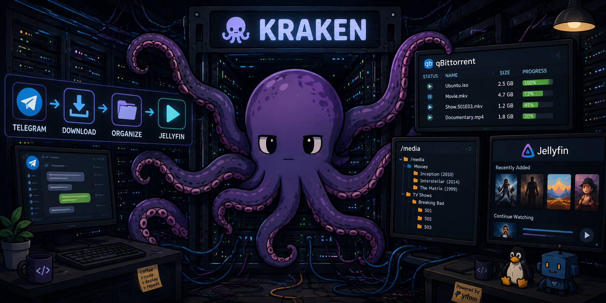
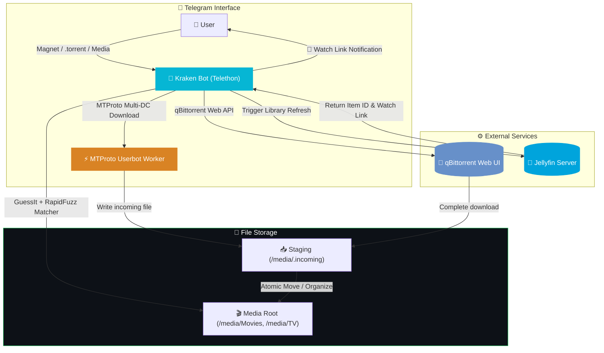
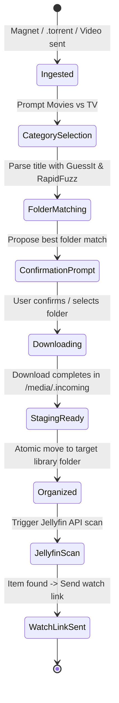

<div align="center">



<br>

### Telegram Command Center for qBittorrent & Jellyfin

**Send magnet links, torrent files, or Telegram media directly from chat.**<br>
Kraken queues downloads, predicts target library folders, triggers Jellyfin scans, and sends watch links.

<br>

<a href="#-quick-start"></a>
<a href="#-features"></a>
<a href="#-architecture"></a>
<a href="#-deploying-to-the-server"></a>

<br><br>


</div>

---

## 📑 Table of Contents

<table>
<tr>
<td valign="top" width="33%">

**Getting Started**
- [✨ Features](#-features)
- [🧠 Architecture](#-architecture)
- [🚀 Quick Start](#-quick-start)
- [🎮 Interactive Workflow](#-interactive-workflow)

</td>
<td valign="top" width="33%">

**Core Engines**
- [🧲 qBittorrent Manager](#-qbittorrent-manager)
- [⚡ Telegram Downloader](#-telegram-downloader)
- [🤖 Smart Folder Matcher](#-smart-folder-matcher)
- [🍿 Jellyfin Integration](#-jellyfin-integration)

</td>
<td valign="top" width="33%">

**Operations & Reference**
- [📂 File Browser](#-file-browser)
- [⚙️ Deploying to the Server](#-deploying-to-the-server)
- [🔑 Shared Media Permissions](#-shared-media-permissions)
- [🧱 Project Structure](#-project-structure)
- [🔧 Configuration Matrix](#-configuration-matrix)

</td>
</tr>
</table>

---

## ✨ Features

<table>
<tr>
<td width="33%" valign="top">

### 🧲 Direct Ingestion
Send **magnet links**, **`.torrent` files**, or **video files** in Telegram chat. Kraken handles the rest automatically.

</td>
<td width="33%" valign="top">

### ⚡ Parallel Downloader
Multi-connection **MTProto Userbot downloader** for Telegram media files, with fallback to standard Telegram Bot API.

</td>
<td width="33%" valign="top">

### 🤖 Smart Folder Matcher
Parses release names with `GuessIt` and matches existing library folders using `RapidFuzz` similarity scoring.

</td>
</tr>
<tr>
<td valign="top">

### 🎛️ qBittorrent Center
In-chat control panel to monitor torrents, pause/resume, adjust speed/priority, and delete downloads.

</td>
<td valign="top">

### 🍿 Jellyfin Auto-Sync
Triggers Jellyfin library scans upon download completion and delivers instant, openable **watch links** in Telegram.

</td>
<td valign="top">

### 📂 In-Chat File Manager
Browse `/media` directories inside Telegram. Inspect, delete, or rename files and folders on the fly.

</td>
</tr>
<tr>
<td valign="top">

### 🛡️ Staging Isolation
Downloads land in a dedicated staging directory (`/media/.incoming`) before atomic transfer, preventing partial media index scans.

</td>
<td valign="top">

### 🇮🇱 Clean Hebrew UI
Intuitive Hebrew interface using single inline-keyboard messages that update in place without cluttering your chat history.

</td>
<td valign="top">

### 🚀 Production Ready
Idempotent systemd setup script (`deploy/install.sh`) for quick zero-downtime server deployments.

</td>
</tr>
</table>

---

## 🧠 Architecture

Kraken acts as the central coordinator between **Telegram**, your **qBittorrent client**, **Media Storage**, and **Jellyfin Server**:



### Media Ingestion State Flow



---

## 🚀 Quick Start

```bash
# 1 · Clone the repository
git clone https://github.com/Omer-Dahan/Kraken.git
cd Kraken

# 2 · Create & activate virtual environment
python -m venv .venv
source .venv/bin/activate  # Linux/macOS  (Windows: .venv\Scripts\activate)

# 3 · Install dependencies
pip install -r requirements.txt

# 4 · Configure environment
cp .env.example .env

# 5 · Start Kraken
python src/telegram_bot.py
```

<details>
<summary><b>⚙️ &nbsp;Configuration File Breakdown (<code>.env</code>)</b></summary>

<br>

| Variable | Description | Default / Example |
|:---|:---|:---|
| `API_ID` | Telegram API ID from [my.telegram.org](https://my.telegram.org/apps) | `123456` |
| `API_HASH` | Telegram API Hash | `your_telegram_api_hash` |
| `BOT_TOKEN` | Telegram Bot Token from [@BotFather](https://t.me/BotFather) | `123456:ABC-DEF...` |
| `ALLOWED_USER_IDS` | Comma-separated list of authorized Telegram User IDs | `123456789` |
| `QBIT_URL` | qBittorrent Web UI URL | `http://localhost:8080` |
| `JELLYFIN_URL` | Internal Jellyfin API address | `http://localhost:8096` |
| `JELLYFIN_PUBLIC_URL` | Public Jellyfin URL for user watch links | `https://jellyfin.yourdomain.com` |
| `JELLYFIN_API_KEY` | Jellyfin Dashboard API Key | `your_jellyfin_api_key` |
| `MEDIA_ROOT` | Target media root directory | `/media` |
| `STAGING_DIR` | Staging incoming downloads directory | `/media/.incoming` |

</details>

<details>
<summary><b>⚡ &nbsp;Enabling High-Speed Userbot Downloader (Optional)</b></summary>

<br>

To enable fast, multi-connection downloading for large Telegram files:

```bash
# Generate authorized Telethon Userbot session
python src/generate_session.py
```

Follow the interactive prompts to enter your phone number and 2FA code. A `session/userbot.session` file will be created and automatically used by Kraken.

</details>

<details>
<summary><b>📋 &nbsp;System Requirements</b></summary>

<br>

- 🐍 **Python 3.11+**
- 🤖 Telegram Bot Token & API Credentials
- 🧲 **qBittorrent** with Web UI enabled
- 🍿 **Jellyfin Server** *(optional, for library refresh & watch links)*
- 💾 Shared Media Directory (`/media`) writable by Kraken, qBittorrent, and Jellyfin
  - via a common group, see [Shared Media Permissions](#-shared-media-permissions)

</details>

---

## 🎮 Interactive Workflow


1. **Ingest Media**: Send a magnet link, a `.torrent` file, or forward a video file directly to the bot.
2. **Category Selection**: Choose whether the content belongs to **Movies** or **TV Shows**.
3. **Folder Proposal**: Kraken parses the title (`GuessIt`) and matches existing library folders (`RapidFuzz`).
4. **User Confirmation**: Confirm the suggested folder or choose a custom target directory via inline buttons.
5. **Auto Processing**: qBittorrent downloads the torrent into staging or the Userbot fetches Telegram media chunks. Once done, files move to their final home.
6. **Jellyfin Watch Link**: Jellyfin scans the library, and Kraken responds with a direct watch link!

---

## 🧲 qBittorrent Manager

Access the real-time torrent management screen anytime via `/torrents`, `/downloads`, or `/status`.

```text
┌─────────────────────────────────────────────────────────────┐
│ 🧲 qBittorrent Downloads (All)                             │
├─────────────────────────────────────────────────────────────┤
│ 🟢 Inception (2010) [1080p]                                 │
│    Progress: [████████████████░░░░] 82.4% · 4.2 MB/s        │
│                                                             │
│ ⏸️ Stranger Things S04 [4K]                                  │
│    Progress: [████████████████████] 100% · Seeding          │
├─────────────────────────────────────────────────────────────┤
│ [ 🔄 Refresh ]  [ ⏸ Pause All ]  [ ▶ Resume All ]           │
│ [ 📋 All (2) ]  [ ⬇ Downloading ] [ ⬆ Seeding ] [ 🤖 Queue ]│
└─────────────────────────────────────────────────────────────┘
```

- **Tabs**: Switch seamlessly between `All`, `Downloading`, `Seeding`, `Paused`, and `Telegram Queue`.
- **Inline Controls**: Pause, resume, delete torrents, or change priority directly from chat.
- **Queue Tab (`/queue`)**: View active Telegram media downloads being processed by the bot worker.

---

## ⚡ Telegram Downloader

Kraken includes a high-performance Telegram media downloader built specifically for large files:

> [!NOTE]
> Standard Telegram Bot API limits file downloads to **20MB**. Kraken overcomes this using Telethon MTProto userbot sessions.

- **Multi-DC Parallel Connections**: Establishes multiple concurrent MTProto TCP/IP connections directly to Telegram Data Centers.
- **Chunked Pipeline**: Downloads media in optimal chunk sizes with atomic buffer flushing.
- **Automatic Fallback**: If no userbot session exists, Kraken gracefully falls back to the standard bot downloader for supported sizes.

---

## 🤖 Smart Folder Matcher

Kraken eliminates messy media libraries through intelligent folder placement:

1. **Title Extraction (`GuessIt`)**: Automatically parses release title, year, season, episode, resolution, and codec.
2. **Fuzzy Search (`RapidFuzz`)**: Searches your existing `/media/Movies` or `/media/TV` tree for similar directory names.
3. **Interactive Confirmation**: If similarity exceeds `SIMILARITY_MENTION_THRESHOLD` (75%), Kraken suggests the matching folder; otherwise, it proposes creating a clean new folder.

```text
Example Match:
Ingested File: "Avatar.The.Way.of.Water.2022.2160p.UHD.BluRay.x265.mkv"
GuessIt Parsing: Title = "Avatar The Way of Water", Year = 2022
RapidFuzz Target: "/media/Movies/Avatar The Way of Water (2022)" -> 98% Match!
```

---

## 🍿 Jellyfin Integration

> [!TIP]
> Ensure `JELLYFIN_API_KEY` is configured in `.env` to unlock automated scans and watch links.

- **Automated Library Scan**: Sends an API call to Jellyfin to refresh media libraries as soon as downloads finish.
- **Smart Polling**: Polls Jellyfin REST API until the newly ingested movie or episode is indexed.
- **Direct Watch Links**: Constructs clickable `JELLYFIN_PUBLIC_URL` links pointing directly to the item detail page in Jellyfin web/app.

---

## 📂 File Browser

Use `/browser` to open the built-in in-chat media browser:

- **Navigate**: Click through folders in your configured `MEDIA_ROOT`.
- **File Actions**: View file sizes, rename items, create new directories, or delete unwanted files directly from Telegram.
- **Page Controls**: Paginated directory listing (`FB_PAGE_SIZE`) for smooth navigation even in huge libraries.

---

## ⚙️ Deploying to the Server

Kraken is designed for simple, self-contained server deployment using `systemd`.

### Structure on Target Server (`/opt/Kraken`)

```text
/opt/Kraken/
├── .venv/            # Isolated virtual environment (created by installer)
├── .env              # Environment config (chmod 600)
├── session/          # Telethon userbot session files (chmod 700)
├── src/              # Python source code
├── deploy/           # Deployment scripts & service unit
└── requirements.txt
```

### Deployment Steps

1. **Sync Files to Server**:
   ```bash
   rsync -av --delete --exclude '.venv' --exclude '.env' --exclude 'session' \
         ./ vm@192.168.1.231:/opt/Kraken/
   ```

2. **Run the Installer**:
   ```bash
   ssh vm@192.168.1.231

   # One-time: the group shared with qBittorrent and Jellyfin (see Shared Media Permissions)
   sudo groupadd -f media

   sudo MEDIA_GROUP=media bash /opt/Kraken/deploy/install.sh
   ```
   > `MEDIA_GROUP` goes **before** `bash`, not after. Omit it and the installer falls back to
   > the service user's own group, which is only correct if qBittorrent runs as that same user.

3. **Configure & Start**:
   ```bash
   # Fill in credentials on initial setup
   nano /opt/Kraken/.env

   # Optionally generate Userbot session
   sudo -u vm /opt/Kraken/.venv/bin/python /opt/Kraken/src/generate_session.py

   # Start service
   sudo systemctl start kraken.service
   sudo journalctl -u kraken.service -f
   ```

> [!IMPORTANT]
> The installer script (`deploy/install.sh`) is **idempotent**. Re-run it safely after every code update. It will never overwrite your existing `.env` or session data.

### 🔑 Shared Media Permissions

Kraken is not the only writer in the media directory. qBittorrent finishes a torrent **as its
own user**, and Kraken then has to move, rename and delete that file. If the two run as
different users, deletes fail with `Permission Denied` - and Kraken cannot chmod its way out,
because Linux only lets a file's *owner* (or root) change its mode.

The fix is a **shared group** rather than shared ownership:

```bash
# 1 · Create the group and put Kraken's service user in it
sudo groupadd -f media
sudo usermod -aG media vm

# 2 · Put qBittorrent's user in it too (check the name first)
ps -o user= -C qbittorrent-nox
sudo usermod -aG media <that-user>
sudo systemctl restart qbittorrent

# 3 · Re-run the installer so it applies group + setgid to the library
sudo MEDIA_GROUP=media bash /opt/Kraken/deploy/install.sh
```

The installer sets `2775` on the library directories. The leading `2` is the **setgid** bit:
every file created there afterwards inherits the `media` group automatically, instead of the
creating process's primary group. That is what stops the problem from returning on each new
download, rather than fixing it once.

Set qBittorrent's umask to `002` as well (Options → Downloads → *Run external program*, or
`UMask=0002` in its systemd unit). Without it, files arrive without group-write permission and
setgid alone is not enough.

**Verify it worked:**

```bash
ls -ld /media/movies     # expect: drwxrwsr-x ... media
id vm                    # expect: 'media' among the groups
```

The `s` in ``drwxrwsr-x`` is the setgid bit. If it is there and both users are in the group,
Kraken can manage anything qBittorrent creates.

> [!NOTE]
> The installer never takes ownership of files that already exist - adopting another service's
> files is not its call. It counts them and prints the exact `chgrp` command to run if any are
> found. Files predating this setup may need that one-time fixup.

---

## 🧱 Project Structure

<details open>
<summary><b>📂 &nbsp;Source Code Overview</b></summary>

<br>

```text
Kraken/
├── 📄 .env.example               # ⚙️ Sample environment configuration
├── 📄 README.md                  # 📖 Project documentation
├── 📄 SOFTWARE_OVERVIEW.md       # 🧠 Internal architectural overview
├── 📄 requirements.txt           # 📦 Python dependencies
│
├── 📂 assets/                    # 🎨 Visual assets & banners
│   └── 📄 kraken-banner.png      # Header banner image
│
├── 📂 deploy/                    # 🚀 Server deployment scripts
│   ├── 📄 install.sh             # Idempotent systemd installer script
│   └── 📄 kraken.service         # Systemd service unit template
│
├── 📂 src/                       # 🧠 Core Python Source
│   ├── 📄 telegram_bot.py        # 🚀 Main entry point & Telethon client orchestrator
│   ├── 📄 bot_config.py          # ⚙️ Environment variables loader & validator
│   ├── 📄 bot_state.py           # 🔒 Runtime state, locks, and active user workflows
│   ├── 📄 confirmation_flow.py   # 📝 Media ingestion, GuessIt parsing & target dialogs
│   ├── 📄 media_organizer.py     # 🤖 Folder similarity matching & atomic file transfers
│   ├── 📄 download_engine.py     # 📥 Telegram download queue worker & status tracker
│   ├── 📄 fast_download.py       # ⚡ High-speed multi-connection MTProto downloader
│   ├── 📄 qbit_client.py         # 🧲 qBittorrent Web API async client
│   ├── 📄 torrents_screen.py     # 🎛️ Torrent control dashboard & inline keyboards
│   ├── 📄 jellyfin_client.py     # 🍿 Jellyfin REST API client & watch link generator
│   ├── 📄 jellyfin_screen.py     # 🍿 Jellyfin library overview & manual scan UI
│   ├── 📄 file_browser.py        # 📂 Local filesystem scanner & helper functions
│   ├── 📄 file_manager_ui.py     # 📂 In-chat file browser UI renderer
│   ├── 📄 keyboards.py           # ⌨️ Telegram inline keyboard layout generators
│   └── 📄 generate_session.py    # 🔑 CLI interactive sign-in for Userbot session
│
└── 📂 tests/                     # 🧪 Unit test suite
    ├── 📄 test_confirmation_flow.py
    ├── 📄 test_download_engine.py
    └── ...
```

</details>

---

## 🔧 Configuration Matrix

| Variable | Category | Description | Default |
|:---|:---:|:---|:---|
| `API_ID` | Telegram | Telegram API App ID | *Required* |
| `API_HASH` | Telegram | Telegram API App Hash | *Required* |
| `BOT_TOKEN` | Telegram | Telegram Bot Token from BotFather | *Required* |
| `ALLOWED_USER_IDS` | Security | Authorized Telegram User IDs (comma-separated) | *Required* |
| `SESSION_PATH` | Telethon | Userbot session file relative path | `userbot` |
| `DOWNLOAD_CONNECTIONS` | Speed | Concurrent MTProto connections for Premium accounts | `10` |
| `NON_PREMIUM_CONNECTIONS` | Speed | Concurrent MTProto connections for standard accounts | `4` |
| `DOWNLOAD_QUEUE_CONCURRENCY` | Worker | Parallel Telegram download workers | `2` |
| `QBIT_URL` | qBittorrent | qBittorrent Web UI base URL | `http://localhost:8080` |
| `JELLYFIN_URL` | Jellyfin | Internal Jellyfin API base URL | `http://localhost:8096` |
| `JELLYFIN_PUBLIC_URL` | Jellyfin | Public-facing Jellyfin URL for watch links | Same as `JELLYFIN_URL` |
| `JELLYFIN_API_KEY` | Jellyfin | API Key created in Jellyfin Dashboard | *Optional* |
| `MEDIA_ROOT` | Storage | Base directory containing `Movies` & `TV` folders | `/media` |
| `STAGING_DIR` | Storage | Incoming temporary downloads directory | `/media/.incoming` |
| `SIMILARITY_MENTION_THRESHOLD` | Matcher | RapidFuzz folder matching confidence % threshold | `75` |
| `FB_PAGE_SIZE` | UI | Items per page in Telegram File Browser | `10` |
| `TORRENTS_PAGE_SIZE` | UI | Items per page in Torrent Dashboard | `6` |

### Installer Variables

Passed on the `install.sh` command line, **not** in `.env` - they configure the systemd unit and
filesystem permissions at install time, and the running bot never reads them.

| Variable | Description | Default |
|:---|:---|:---|
| `SERVICE_USER` | System user the service runs as | `vm` |
| `SERVICE_GROUP` | Primary group of the service user | Same as `SERVICE_USER` |
| `MEDIA_GROUP` | Shared group owning the media library - see [Shared Media Permissions](#-shared-media-permissions) | Same as `SERVICE_GROUP` |

```bash
sudo SERVICE_USER=vm MEDIA_GROUP=media bash /opt/Kraken/deploy/install.sh
```

---

## 🔒 Security & Privacy

- **Access Restriction**: Only Telegram User IDs explicitly defined in `ALLOWED_USER_IDS` can interact with the bot.
- **Credential Protection**: `.env` and `session/` directory are excluded from Git and permission-restricted (`chmod 600` / `700`).
- **Input Sanitization**: File names and directory targets are sanitized before moving or deleting files on host disk.

---

<div align="center">

---

**Made with ❤️ by Omer**

<sub>Streamlining media management with automated Telegram controls.</sub>

<a href="https://github.com/Omer-Dahan/Kraken"></a>

</div>
